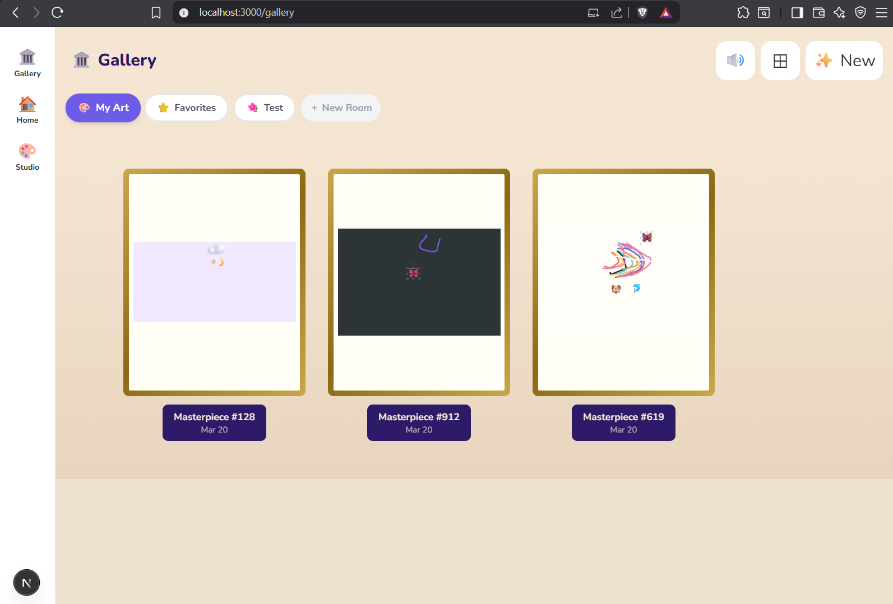

# Devlog

## Phase 0: `docs\BLUEPRINT.md`

---

## Phase 0.5: Bootstrap Execution Plan — Git Init → Running Canvas

---

## Phase 1: The Sketchbook (MVP)
*Completed: 2026-03-20*

The goal of Phase 1 was to establish the "Core Loop": Draw → Save → View in Gallery.

### Key Milestones
- **Bootstrap & Scaffold**: Set up the project structure with Next.js, Fabric.js, and Dexie.js (IndexedDB).
- **Core Canvas**: Implemented freehand drawing with kid-friendly brushes (Crayon, Pencil, Marker, Spray).
- **Studio UI**: Created a custom toolbar with bold colors and simple touch targets.
- **Storage Layer**: Built a robust local storage system using Dexie.js to store artworks, thumbnails, and room data.
- **Museum Gallery**: Created two primary views for exploring art:
    - **Museum Walk**: A horizontal, immersive scrolling view where art hangs on the wall.
    - **Grid View**: A flexible layout for quickly browsing the collection.
- **Exhibit View**: A dedicated detail view for each artwork, featuring rename, favorite, and delete capabilities.

### Critical Fixes
- **Fabric.js Stability**: Integrated null guards for brushes and handled SSR issues with dynamic imports.
- **Parent Gate**: Implemented a "Grown-Up Check" (simple multiplication) to protect destructive actions like deletion.
- **HMR/Strict Mode**: Handled double-rendering issues in development to prevent canvas duplication.

---

## Phase 2: Import & Collage
*Completed: 2026-03-20*

Phase 2 expanded the creative possibilities with image imports, stickers, and shapes.

### Key Milestones
- **Import Pipeline**: Added support for importing images via Camera capture and local file selection (PNG, JPEG, SVG).
- **Collage Tools**:
    - **Shapes**: Instant circles, squares, stars, and hearts.
    - **Stickers**: A library of 24+ emoji-based stickers that can be added and scaled.
- **Select & Transform**: Implemented a "Direct Select" (👆) mode to move, resize, and rotate objects on the canvas.
- **Auto-Save**: Implemented a background auto-save system (30s interval) using `requestIdleCallback` to prevent jank.
- **Room Management**: Added the ability for kids (and parents) to create multiple rooms and organize art by theme.
- **Performance Polish**: Migrated thumbnail and full-res storage to optimized Data URLs to eliminate "Blob URL expired" errors.

### Stability & UX
- **Testing Suite**: Set up Vitest and implemented 20+ unit tests covering storage CRUD and canvas history logic.
- **Touch Layer**: Rewrote the touch gesture handler to properly distinguish between drawing and selecting/transforming.
- **History Fixes**: Corrected undo/redo logic to support both freehand paths and complex objects (shapes/stickers).

---

## Phase 2.1: Polish Sprint
*Completed: 2026-03-20*

Final touches to make the experience feel "premium" and delightful.

### Features
- **Sound System**: Procedurally generated audio feedback for every interaction (save, sparkle, switch, delete).
- **Entrance Animations**: Added staggered CSS animations for a "wow" effect when entering the gallery.
- **Status Indicators**: Added a visual pulse when the Eraser is active to clarify drawing mode.
- **Sound Toggle**: Global mute/unmute control in the gallery and home screen.

---

## Project Status: PHASE 2 COMPLETE ✅

### Current State
- [x] Core drawing & toolset
- [x] Image/Sticker/Shape collage workflow
- [x] Immersive Museum & Grid views
- [x] Multi-room organization
- [x] Offline-first PWA (IndexedDB)
- [x] Procedural Sound & Micro-animations
- [x] Unit Testing Coverage (Core Data)

**ALL GREEN**



### Deaitled log for previous phases `local-files\OLDLOG.md`

---

## Phase 3: Flipbook Animator 🎬

The feature that turns drawings into magic. A 7-year-old making first animation — that's a core memory.

### Design Philosophy
```
NOT THIS:                    THIS:
┌─────────────────┐         ┌─────────────────┐
│ Timeline         │         │                 │
│ ▶ ■ ◀ │◀ ▶│    │         │   Draw here     │
│ Layer 1 ═══════ │         │                 │
│ Layer 2 ═══════ │         │   (big canvas)  │
│ Keyframe editor │         │                 │
│ Easing curves   │         ├─────────────────┤
│ (After Effects) │         │ ◀ Frame 3/8 ▶  │
└─────────────────┘         │ [👻] [▶ Play]   │
                            └─────────────────┘

 Complex, overwhelming        Simple, tactile
 for a professional           like flipping a notebook
 ```

 ### Architecture
```
FLIPBOOK DATA MODEL
━━━━━━━━━━━━━━━━━━━━━━━━━━━━━━━━

  Flipbook
  ├── id: string
  ├── title: string
  ├── fps: number (2-12, default 4)
  ├── frames: Frame[]
  │   ├── Frame 0: { canvasJSON, thumbnail }
  │   ├── Frame 1: { canvasJSON, thumbnail }
  │   ├── Frame 2: { canvasJSON, thumbnail }
  │   └── ...
  └── metadata (room, tags, dates)

CANVAS FLOW
━━━━━━━━━━━━━━━━━━━━━━━━━━━━━━━━

  Draw on Frame 3
       │
       ├── Onion skin: Frame 2 visible at 30% opacity
       │
       ├── Tap ▶ → next frame (auto-saves current)
       ├── Tap ◀ → prev frame
       ├── Tap ＋ → new blank frame (or duplicate)
       ├── Tap 👻 → toggle onion skin
       ├── Tap ▶ Play → animate all frames in sequence
       └── Tap 🏛️ → export GIF → save to gallery
```

### 1. Data Model Extension

- src/lib/storage/db.ts — REPLACED ENTIRE FILE

### 2. Flipbook Storage

- src/lib/storage/flipbook.ts — NEW

### 3. GIF Export

- src/lib/export/gif.ts — NEW

### 4. Flipbook Canvas Component

- src/components/flipbook/FlipbookStudio.tsx — NEW

### 5. Frame Strip Component

- src/components/flipbook/FrameStrip.tsx — NEW

### 6. Playback Overlay

- src/components/flipbook/PlaybackOverlay.tsx — NEW

### 7. Route + Page

- src/app/studio/flipbook/page.tsx — NEW

### 8. Add Flipbook Entry to Home + Gallery

- src/app/page.tsx — Add Flipbook Door
Added a third option below the two big doors:

**Navigate to /studio/flipbook** 
- should see a frame-by-frame animation studio with frame strip, navigation, speed control, and a play button. Draw on frame 1, tap ＋, draw on frame 2, hit ▶️
                                                                        


---Add

## Phase 3: Flipbook Animator ✅
*Completed: 2026-03-21*

Frame-by-frame animation studio. A 7-year-old making their first animation — that's a core memory.

### Key Milestones
- **Flipbook Studio** (`/studio/flipbook`): Full-screen canvas with onion skinning, frame navigation (◀ ▶), frame strip thumbnail row.
- **Frame Management**: Add blank frame or duplicate current, up to practical limits. Each frame stores Fabric.js JSON + thumbnail.
- **Playback**: Animate all frames at configurable FPS (2–12). Overlay mode so you can watch then return to editing.
- **GIF Export**: Renders all frames to a GIF via canvas capture, saves to local gallery as a regular artwork.
- **Home Screen Door**: Added 🎬 Flipbook entry on the home screen alongside Studio and Gallery.
- **Flipbook Badge**: Gallery cards show 🎬 badge on flipbook artworks.

### Storage
- `src/lib/storage/flipbook.ts` — Flipbook/Frame CRUD on top of Dexie (separate table).
- `src/lib/export/gif.ts` — Frame-to-GIF pipeline using canvas-to-blob per frame.

---

## Phase 3.5 → 4: Ship Online ✅
*Completed: 2026-03-21*

Deployed to Vercel. Added a Publish flow so artwork from any device can appear in a public online gallery.

### Architecture Decision
- **Studio stays 100% local** — Fabric.js + IndexedDB, unchanged.
- **Publish = explicit action** — 🌐 button exports canvas PNG → Supabase Storage + metadata row in Postgres.
- **Public gallery** — `/gallery/published` is a Next.js ISR page (60s revalidation), zero auth, public URL.
- **No auth anywhere** — anon Supabase key for all operations.
- **Hosting**: Vercel free tier. **DB + Storage**: Supabase free tier.

### Key Milestones
- **Cloud library** (`src/lib/cloud/`): `publishArtwork`, `unpublishArtwork`, `fetchPublishedArtworks` with 8 unit tests.
- **🌐 Publish button** in studio toolbar: uploads PNG to Supabase Storage, upserts metadata, shows toast with auto-dismiss (6s), error feedback on failure.
- **Published badges**: 🌐 badge on gallery cards for published artworks, 🎬 badge for flipbooks.
- **`/gallery/published`**: Public grid page, ISR 60s, gold-frame cards, empty state, 🎬 badge for flipbooks.
- **Exhibit view**: Shows "🌐 Published online" status + parent-gated Unpublish button when artwork is live.
- **Dexie fix**: `update({publishedUrl: undefined})` is a no-op in Dexie — fixed with `modify()` to actually delete the field.
- **Save preserves publish state**: `saveArtwork` now carries forward `publishedUrl` on re-save.
- **Vercel deploy**: Live at https://tiny-museum-iota.vercel.app

### Stack additions
- `@supabase/supabase-js` v2 — Postgres + Storage client.
- Supabase project: `zylwahbviaphcjhrtugw`. Table: `published_artworks`. Bucket: `artwork-files` (public).

### Tests
- 28 tests passing (all green).

---

## Current Status: PHASE 4 COMPLETE ✅ — Live on Web
*2026-03-21*

### Shipped
- [x] Core drawing & toolset
- [x] Import / collage workflow (camera, files, shapes, stickers)
- [x] Multi-room gallery (IndexedDB, local-first)
- [x] Flipbook animator (frame-by-frame, GIF export)
- [x] Publish to web (Supabase Storage + Postgres, ISR gallery)
- [x] Vercel deploy — https://tiny-museum-iota.vercel.app
- [x] 28 unit tests passing

### Published gallery
- /gallery/published is one shared public URL. Anyone with the link sees all published artworks. There's no per-user isolation today.
- Studio — fully local (IndexedDB per browser). Anyone visiting the URL gets their own blank studio, stored on their own device. No accounts, no shared state.
- Future restriction — straightforward to add: a simple PIN/passcode gate on the home screen would lock the studio to Mira's device

### Bug Fixes (post-launch)
- **Save crash**: `saveArtwork` extracted Fabric.js methods called without `.call(fabricCanvas)` — `this` was `undefined` in strict mode. Fixed all 4 method calls.
- **Flipbook deadlock**: `containerRef` div was inside an early-return path that required `loaded=true`, but canvas init requires the div in the DOM → permanent deadlock. Fixed by always rendering the container with the spinner as an absolute overlay inside.

---

## Sprint 1: Bug Fixes ✅
*Completed: 2026-03-21*

### Fixed
- **Room rename**: Added `renameRoom()` to storage + long-press (500ms) on room pill → ParentGate → inline edit. Default rooms (`My Art`, `Favorites`) are protected.
- **Favorites room**: Was filtering by `roomId === 'favorites'` (always empty). Fixed: filters by `tags.includes('favorite')` across all artworks.
- **Flipbook in Gallery**: Exhibit view now shows thumbnail, ▶️ Play button opens `PlaybackOverlay` (with built-in GIF export), Edit routes to `/studio/flipbook`. Deleting a flipbook now cleans up frames (was leaving orphaned IndexedDB data).
- **Flipbook mobile layout**: Portrait — `min-h-0` on canvas container so controls stay visible. Landscape — frame strip capped to `h-20`, canvas fills remaining space.

### Tests: 30 passing (up from 28)

---

## Post-Sprint 1 Fix
*2026-03-21*

- **Flipbook thumbnail aspect ratio**: `sendToGallery` was hardcoding 400×300, squishing any canvas wider or taller than 4:3. Fixed: captures at `canvas.getWidth()` × `canvas.getHeight()` (actual logical dimensions). Width/height now stored in `canvasJSON` so `PlaybackOverlay` in the exhibit view also uses the correct dimensions instead of the 400×300 fallback.

● Pushed. The previous fixes were treating symptoms — this addresses the root cause.    

  What was actually wrong: The canvas fills its container. In landscape on mobile, the  
  container is only ~112px tall (viewport minus topbar + frame strip + controls). When  
  you tapped Play in landscape, canvas.getHeight() = 112. PlaybackOverlay rendered      
  frames at 780×112, but your drawings were at portrait coordinates (y up to ~600).     
  Everything below y=112 was off-screen — you saw a thin strip of background.

  What's fixed: saveCurrentFrame now stores _w and _h (the logical canvas size at draw  
  time) inside each frame's JSON. PlaybackOverlay reads those per-frame dimensions for  
  rendering and display. Existing frames without _w/_h fall back to current behavior.

---

## Sprint 1.1: Repo / Pro (Maintenance) ✅
*Completed: 2026-03-21*

Transitioned the hobby project to a professional, contributor-ready repository.

### Key Milestones
- **CI/CD Pipeline**: GitHub Actions now runs `lint`, `typecheck`, and `test` on every push/PR.
- **Robust Testing**: Expanded the test suite from 30 to **50 passing unit tests**. Covered Cloud Publish, Flipbook Studio, GIF Export, Room Management, and Storage Utils.
- **Full Documentation**:
    - `README.md`: Modern project overview and setup guide.
    - `CONTRIBUTING.md`: Standards for new collaborators.
    - `docs/ARCHITECTURE.md`: Technical deep-dive for developers.
    - `LICENSE`: MIT.
- **Vercel Build Hygiene**: Optimized `next.config.ts` and `.gitignore` to ensure clean production builds and repository maintenance.

## Sprint 1.2: CI Recovery & Asset Optimization ✅
*Completed: 2026-03-21*

Resolved critical CI/CD failures and optimized image handling for Next.js best practices.

### Key Milestones
- **CI Restoration (ESLint 9)**: 
    - Migrated to the new Flat Config system (`eslint.config.mjs`) to resolve deprecation errors.
    - Suppressed persistent `no-explicit-any` warnings in critical storage layers (`artworks.ts`) to achieve a green build.
- **Next.js Image Migration**: 
    - Replaced all standard `img` tags with `next/image` in `ArtworkCard`, `PublishedGallery`, `FrameStrip`, and `ImportPanel`.
    - Implemented `unoptimized` prop for local Blob URLs to maintain performance without complex loader configurations.
- **Supabase Integration**: 
    - Updated `client.ts` to support the new `NEXT_PUBLIC_SUPABASE_PUBLISHABLE_DEFAULT_KEY` format.
    - Configured production environment variables in Vercel to unblock the live Gallery build.
- **Verification**: Zero errors across `lint`, `typecheck`, and `format`. All **50 unit tests** passing in the automated pipeline.

---

## Next Actions (backlog)

### Sprint 2: Make It Showable
- **Demo content** — publish a few nice artworks/flipbooks so `/gallery/published` looks great for new visitors (zero code — just publish from the studio).
- **Gallery thumbnail polish** — switch `object-contain` → `object-cover`.
- **Mobile polish** — safe-area insets, keyboard avoidance.

### Future (Phase 5)
- 3D walkable museum (Three.js / React Three Fiber).
- Studio access control — simple PIN gate to lock studio to Mira's device.
- Online monitoring: Vercel Speed Insights + Analytics.