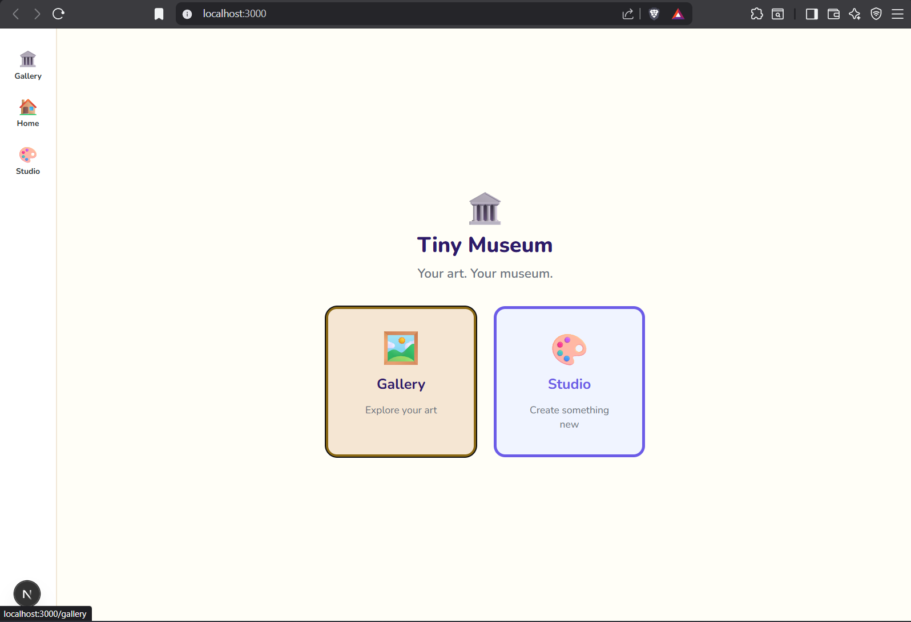
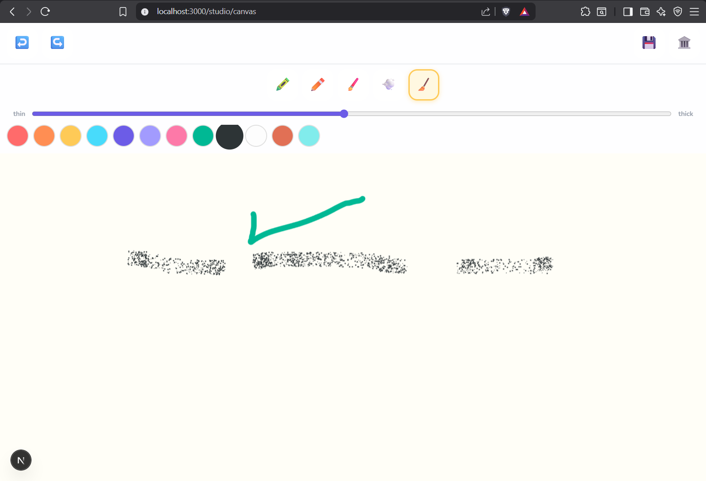

# Devlog

## Phase 0: `docs\BLUEPRINT.md`

---

## Phase 1: Bootstrap Execution Plan — Git Init → Running Canvas

### Step 1: Restructure & Scaffold (Terminal)
```bash
# ── Move existing files into src/ structure ──
New-Item -ItemType Directory -Force -Path src/components/canvas
New-Item -ItemType Directory -Force -Path src/components/gallery
New-Item -ItemType Directory -Force -Path src/components/ui
New-Item -ItemType Directory -Force -Path src/components/layout
New-Item -ItemType Directory -Force -Path src/lib/fabric
New-Item -ItemType Directory -Force -Path src/lib/storage
New-Item -ItemType Directory -Force -Path src/lib/audio
New-Item -ItemType Directory -Force -Path src/lib/export
New-Item -ItemType Directory -Force -Path src/app/gallery
New-Item -ItemType Directory -Force -Path src/app/studio/canvas
New-Item -ItemType Directory -Force -Path src/app/settings
New-Item -ItemType Directory -Force -Path src/stores
New-Item -ItemType Directory -Force -Path src/hooks
New-Item -ItemType Directory -Force -Path src/styles
New-Item -ItemType Directory -Force -Path src/assets/stickers
New-Item -ItemType Directory -Force -Path src/assets/sounds
New-Item -ItemType Directory -Force -Path src/assets/frames
New-Item -ItemType Directory -Force -Path src/assets/textures

# ── Move your existing files ──
Move-Item -Force components/canvas/Toolbar.tsx src/components/canvas/
Move-Item -Force components/gallery/useumWalk.tsx src/components/gallery/MuseumWalk.tsx
Move-Item -Force components/ui/ParentGate.tsx src/components/ui/
Move-Item -Force lib/fabric/setup.ts src/lib/fabric/
Move-Item -Force lib/fabric/touch.ts src/lib/fabric/
Move-Item -Force lib/storage/db.ts src/lib/storage/

# ── Clean up empty old directories ──
Remove-Item -Recurse -Force components
Remove-Item -Recurse -Force lib
```

### Step 2: Package & Config Files

### Step 3: Install
```bash
npm install
```
### Step 4: App Shell

- src/app/layout.tsx
- src/styles/globals.css
- src/app/page.tsx — The Front Door

### Step 5: Core Library Files (Fixed Versions)

- src/lib/fabric/tools.ts — NEW
- src/lib/fabric/setup.ts — FIXED
- src/lib/fabric/touch.ts — FIXED
- src/lib/fabric/history.ts — NEW

### Step 6: Hooks

- src/hooks/useFabricCanvas.ts
- src/hooks/useSounds.ts — Stub for Now

### Step 7: Components

- src/components/ui/BigButton.tsx — NEW
- src/components/canvas/Toolbar.tsx — FIXED
- src/components/canvas/StudioCanvas.tsx — NEW (The Main Workspace)

### Step 8: Pages

- src/app/studio/canvas/page.tsx
- src/app/gallery/page.tsx — Placeholder for Now

### Step 9: Studio Layout Fix

- The studio needs to hide the bottom nav. Add wrapper: `src/app/studio/layout.tsx`

---

## Current State → Next Target
 ✅ Project scaffolded & compiling
 ✅ Canvas renders with drawing tools
 ✅ Undo/redo wired
 ⬜ Storage layer (Dexie)          ← NOW
 ⬜ Save artwork to gallery        ← NOW
 ⬜ Gallery displays real artworks  ← NOW
 ⬜ Artwork detail / exhibit view   ← NOW
 ⬜ Rooms & organization           ← NEXT
 ⬜ Polish, sounds, celebrations   ← LATER

**The magic moment** we're building toward: a kid draws something, taps 🏛️, and walks into a gallery to see art hanging on the wall. Everything below serves that.

## Phase 2 (2026-03-20)

### 1. Storage Layer — src/lib/storage/db.ts

### 2. Artwork CRUD — src/lib/storage/artworks.ts

### 3. Room CRUD — src/lib/storage/rooms.ts

### 4. Zustand Store — src/stores/gallery.store.ts

- src/stores/ui.store.ts

### 5. Updated StudioCanvas — Full Save Pipeline

- // src/components/canvas/StudioCanvas.tsx

### 6. Gallery — Real Artwork Display

- src/components/gallery/ArtworkCard.tsx
- src/components/gallery/MuseumWalk.tsx — REWRITTEN
- src/components/gallery/GalleryGrid.tsx — NEW
- src/components/gallery/RoomSelector.tsx — NEW

### 7. Gallery Page — Fully Wired

- src/app/gallery/page.tsx — REWRITE

### 8. Exhibit View — Single Artwork Detail

- src/app/gallery/[artworkId]/page.tsx

### 9. Celebration Component — src/components/ui/Celebrations.tsx

- Wire it into layout — src/app/layout.tsx update
- Add inside the <body>, after the <nav>:
```tsx
// At the top, add import:
import { Celebrations } from '@/components/ui/Celebrations';

// Inside <body>, after </nav>:
<Celebrations />
```
---

## Phase 2.5 Let's Go (2026-03-20)

```bash
PS E:\co\tiny-museum> npm run dev

> tiny-museum@0.1.0 dev
> next dev --turbopack

   ▲ Next.js 15.5.14 (Turbopack)
   - Local:        http://localhost:3000
   - Network:      http://192.168.56.1:3000

 ✓ Starting...
 ✓ Ready in 8.1s
 ⚠ Webpack is configured while Turbopack is not, which may cause problems.
 ⚠ See instructions if you need to configure Turbopack:
  https://nextjs.org/docs/app/api-reference/next-config-js/turbopack

 ○ Compiling / ...
 ✓ Compiled / in 11.9s
 GET / 200 in 12641ms
 ```
 

### What we have now
 ```
 THE CORE LOOP
━━━━━━━━━━━━━━━━━━━━━━━━━━━━━━━━━━━

  🏠 Home
   │
   ├──► 🎨 Studio
   │     │
   │     ├── Draw with crayon/pencil/marker/spray
   │     ├── Undo / Redo
   │     ├── Choose colors
   │     ├── 💾 Quick save (stays in studio)
   │     └── 🏛️ Send to Gallery ──┐
   │                               │
   └──► 🏛️ Gallery ◄──────────────┘
         │
         ├── Room selector (My Art / Favorites)
         ├── Museum Walk (swipeable)
         ├── Grid View (toggle)
         └── Tap artwork → Exhibit View
              │
              ├── Full-frame display
              ├── Rename (tap title)
              ├── ⭐ Favorite
              ├── 📥 Download PNG
              └── 🗑️ Delete
```

### Fix Batch — All Blockers + Agent Findings
- Three categories: build-breaking, console errors, agent-flagged gaps. All in one pass.

#### Build Breakers
- Fix 1: Studio Page — 'use client' Missing
```tsx
// src/app/studio/canvas/page.tsx — REPLACE ENTIRE FILE

'use client';

import dynamic from 'next/dynamic';

const StudioCanvas = dynamic(
  () => import('@/components/canvas/StudioCanvas'),
  {
    ssr: false,
    loading: () => (
      <div className="flex items-center justify-center h-[100dvh] bg-studio-bg">
        <div className="text-center">
          <p className="text-5xl mb-3 animate-bounce">🎨</p>
          <p className="text-xl font-bold text-kid-purple">
            Opening Studio...
          </p>
        </div>
      </div>
    ),
  }
);

export default function StudioCanvasPage() {
  return <StudioCanvas />;
}
```
- Fix 2: Toolbar — Null Guards on freeDrawingBrush
// src/components/canvas/Toolbar.tsx — REPLACED ENTIRE FILE

#### Console Errors

- Fix 3: manifest.json — Valid JSON (No Comments) REPLACED
- Fix 4: Favicon — Generated a Simple SVG Favicon 
```bash
<svg xmlns="http://www.w3.org/2000/svg" viewBox="0 0 100 100">
  <text y=".9em" font-size="90">🏛️</text>
</svg>
```

- Add to src/app/layout.tsx inside <head>:

```tsx
<link rel="icon" href="/favicon.svg" type="image/svg+xml" />
```

- Fix 5: Turbopack Warning — Remove Webpack Config
Replaced next.config.ts:

- Since we're using Turbopack (--turbopack flag), the webpack config block causes the warning. Fabric.js v6 is pure ESM and doesn't need the canvas: false alias in the browser — that was for server-side Node canvas which we're avoiding entirely via ssr: false.

#### Agent-Flagged Gaps

- Fix 6: Studio Layout — Bottom Nav Hiding
The CSS sibling selector fails because of nesting. Replace with a simpler approach.
```tsx
// src/app/studio/layout.tsx — REPLACE ENTIRE FILE

'use client';

import { useEffect } from 'react';

export default function StudioLayout({
  children,
}: {
  children: React.ReactNode;
}) {
  // Add class to body so global CSS can hide the nav
  useEffect(() => {
    document.body.classList.add('studio-active');
    return () => {
      document.body.classList.remove('studio-active');
    };
  }, []);

  return <>{children}</>;
}
```

- Then update src/styles/globals.css — find the existing .studio-active rules and replace with:

```css
/* ── Studio: hide bottom nav, full height ── */
body.studio-active .bottom-nav {
  display: none !important;
}
body.studio-active .app-shell {
  height: 100dvh;
}

/* Tablet override too */
@media (min-width: 768px) {
  body.studio-active .app-shell {
    margin-left: 0;
  }
}
```
- Remove the old .studio-active .bottom-nav and .studio-active .app-shell blocks.


- Fix 7: FriendlyDialog — Replaces confirm()

```tsx
// src/components/ui/FriendlyDialog.tsx — NEW FILE

'use client';

import { BigButton } from './BigButton';

interface FriendlyDialogProps {
  emoji: string;
  title: string;
  message: string;
  confirmLabel: string;
  confirmEmoji?: string;
  cancelLabel?: string;
  danger?: boolean;
  onConfirm: () => void;
  onCancel: () => void;
}

export function FriendlyDialog({
  emoji,
  title,
  message,
  confirmLabel,
  confirmEmoji = '✓',
  cancelLabel = 'Go back',
  danger = false,
  onConfirm,
  onCancel,
}: FriendlyDialogProps) {
  return (
    <div
      className="fixed inset-0 z-[999] flex items-center justify-center px-6"
      style={{ background: 'rgba(0,0,0,0.4)' }}
      onClick={onCancel}
    >
      <div
        className="bg-white rounded-kid p-6 max-w-sm w-full text-center shadow-2xl"
        onClick={(e) => e.stopPropagation()}
        role="alertdialog"
        aria-label={title}
      >
        <p className="text-5xl mb-3">{emoji}</p>
        <h2 className="text-xl font-extrabold mb-2">{title}</h2>
        <p className="text-gray-500 mb-6 text-base">{message}</p>

        <div className="flex gap-3 justify-center">
          <button
            onClick={onCancel}
            className="px-5 py-3 bg-gray-100 rounded-kid font-bold text-base
                       active:scale-95 transition-transform min-h-[48px]"
          >
            {cancelLabel} 💚
          </button>
          <button
            onClick={onConfirm}
            className={`px-5 py-3 rounded-kid font-bold text-base text-white
                       active:scale-95 transition-transform min-h-[48px]
                       ${danger ? 'bg-kid-red' : 'bg-kid-purple'}`}
          >
            {confirmLabel} {confirmEmoji}
          </button>
        </div>
      </div>
    </div>
  );
}
```

- Fix 8: Exhibit Page — Wire FriendlyDialog + ParentGate to Delete
// src/app/gallery/[artworkId]/page.tsx — REPLACED ENTIRE FILE


- Fix 9: ParentGate Needs Update for onCancel Flow
Check your src/components/ui/ParentGate.tsx matches this interface:

```tsx
// src/components/ui/ParentGate.tsx — REPLACE ENTIRE FILE

'use client';

import { useState, useMemo } from 'react';

interface ParentGateProps {
  onUnlock: () => void;
  onCancel: () => void;
  message?: string;
}

export function ParentGate({ onUnlock, onCancel, message }: ParentGateProps) {
  const problem = useMemo(() => {
    const a = Math.floor(Math.random() * 8) + 3;
    const b = Math.floor(Math.random() * 8) + 3;
    return { a, b, answer: a * b };
  }, []);

  const [input, setInput] = useState('');
  const [wrong, setWrong] = useState(false);

  function check() {
    if (parseInt(input, 10) === problem.answer) {
      onUnlock();
    } else {
      setWrong(true);
      setInput('');
      setTimeout(() => setWrong(false), 1500);
    }
  }

  return (
    <div
      className="fixed inset-0 z-[999] flex items-center justify-center px-6"
      style={{ background: 'rgba(0,0,0,0.5)' }}
      onClick={onCancel}
    >
      <div
        className="bg-white rounded-kid p-6 max-w-sm w-full text-center shadow-2xl"
        onClick={(e) => e.stopPropagation()}
        role="dialog"
        aria-label="Parent verification"
      >
        <h2 className="text-2xl font-extrabold mb-2">
          👋 Grown-Up Check
        </h2>
        <p className="text-gray-500 mb-4 text-base">
          {message ?? 'This needs a grown-up. Solve to continue:'}
        </p>

        <p className="text-3xl font-extrabold mb-4 text-kid-purple">
          {problem.a} × {problem.b} = ?
        </p>

        <input
          type="number"
          inputMode="numeric"
          value={input}
          onChange={(e) => setInput(e.target.value)}
          onKeyDown={(e) => e.key === 'Enter' && check()}
          autoFocus
          className="text-2xl text-center w-24 py-2 border-3 border-gray-200
                     rounded-kid outline-none focus:border-kid-purple
                     transition-colors"
        />

        <div className="flex gap-3 justify-center mt-5">
          <button
            onClick={onCancel}
            className="px-5 py-3 bg-gray-100 rounded-kid font-bold
                       active:scale-95 transition-transform min-h-[48px]"
          >
            Go Back
          </button>
          <button
            onClick={check}
            className="px-5 py-3 bg-kid-purple text-white rounded-kid font-bold
                       active:scale-95 transition-transform min-h-[48px]"
          >
            Check ✓
          </button>
        </div>

        {wrong && (
          <p className="text-kid-red font-bold mt-3 animate-pulse">
            Not quite — try again! 🤔
          </p>
        )}
      </div>
    </div>
  );
}
```

#### Updated Layout with Favicon + Celebrations

- // src/app/layout.tsx — REPLACED ENTIRE FILE

### Full Fix Checklist
FIXES APPLIED
━━━━━━━━━━━━━━━━━━━━━━━━━━━━━━━━━━━━━━━━━━━

Build Breakers:
  ✅ Studio page: added 'use client' for dynamic import
  ✅ Toolbar: null guards on freeDrawingBrush
  ✅ next.config.ts: removed webpack block (Turbopack clean)

Console Errors:
  ✅ manifest.json: valid JSON, no comments
  ✅ favicon.svg: created in public/
  ✅ layout.tsx: favicon wired via metadata

Agent-Flagged Gaps:
  ✅ Studio layout: body class approach (no CSS sibling hack)
  ✅ FriendlyDialog: chunky kid-safe modal component
  ✅ ParentGate: wired to delete flow
  ✅ Delete flow: FriendlyDialog → ParentGate → actual delete
  ✅ Celebrations: wired into root layout

FILES CHANGED (8):
  src/app/studio/canvas/page.tsx    ← 'use client' added
  src/app/studio/layout.tsx         ← body class approach
  src/app/layout.tsx                ← celebrations + favicon
  src/app/gallery/[artworkId]/page.tsx ← FriendlyDialog + ParentGate
  src/components/canvas/Toolbar.tsx ← null guards
  src/components/ui/FriendlyDialog.tsx ← NEW
  src/components/ui/ParentGate.tsx  ← cleaned up
  next.config.ts                    ← simplified

FILES CREATED (2):
  public/favicon.svg
  src/components/ui/FriendlyDialog.tsx

### All three routes should now load clean: /, /gallery, /studio/canvas. Draw something → hit 🏛️ → see it framed. That's the test. 🎨

---




IMMEDIATE (should do now if time):
  ☐ Test the full draw → save → gallery → exhibit flow
  ☐ Fix any runtime issues from first real usage

WEEK 2 SPRINT:
  ☐ Background picker (paper textures, colors)
  ☐ Basic shapes (circle, square, star, heart)
  ☐ Sticker pack v1 (bundled SVGs, drag to canvas)
  ☐ Eraser that actually erases (not bg-color paint)
  ☐ Auto-save every 30 seconds
  ☐ Re-open existing artwork from gallery

  ---

  ## QUALITY GATES (interwoven, not deferred)
━━━━━━━━━━━━━━━━━━━━━━━━━━━━━━━━━━━━━━━━━━━━━━

  NOW (after this sprint):
    ☐ ESLint + Prettier config
    ☐ Pre-commit hook (lint-staged + husky)
    ☐ TypeScript strict mode audit (fix all 'any')

  AFTER IMPORT PIPELINE (Sprint 3):
    ☐ Vitest setup + first unit tests
       → storage CRUD (artworks, rooms)
       → history (undo/redo state machine)
       → thumbnail generation
    ☐ Playwright install + smoke tests
       → draw → save → gallery → exhibit (the core loop)
       → import image → canvas → save
       → parent gate blocks without answer

  BEFORE SHARING FEATURES (Sprint 4):
    ☐ Full component test coverage
    ☐ Accessibility audit (screen reader, color contrast)
    ☐ Lighthouse PWA audit pass
    ☐ Mobile device matrix test (iOS Safari, Android Chrome)

  WHY THIS ORDER:
    Tests on unstable APIs waste time.
    Import pipeline changes canvas + storage contracts.
    Once those stabilize → lock them with tests.

---

## The Big Picture — Still On Track
PHASE 1  ✅ Sketchbook     ← WE ARE HERE (core loop works)
PHASE 2  🔨 Import Studio   ← THIS SPRINT
PHASE 3  ⬜ Flipbook/Animation
PHASE 4  ⬜ Gallery Sharing (family links, publishable)

The "publishable gallery" is Phase 4 but it's
ARCHITECTURALLY PREPARED from day 1:
  → Each artwork has a unique ID
  → Full-res blobs stored separately
  → Room structure = shareable collections
  → Share = generate token → family-only link
  → Parent gate guards all sharing

Import/edit of personal artworks = THIS SPRINT.
That's the thing that makes it HER app, not a toy.

---

## Sprint 3: Import Pipeline + Canvas Upgrades

- What we're building:

```
┌─────────────────────────────────────────┐
│           IMPORT SOURCES                │
│                                         │
│  📷 Camera ──┐                          │
│              ├──► Import Flow ──► Canvas │
│  📁 Files ──┘    (crop/clean)           │
│                                         │
│           CANVAS UPGRADES               │
│                                         │
│  🎨 Background picker (colors+textures) │
│  ⭕ Shapes (circle, square, star, heart)│
│  🖼️ Images as canvas objects            │
│  👆 Select/Move/Resize mode             │
│                                         │
└─────────────────────────────────────────┘
```

### 1. Import — Camera Capture

- src/lib/import/camera.ts
- src/lib/import/file.ts
- src/lib/import/cleanup.ts — Image Enhancement for Scanned Drawings

### 2. Import UI Components
- src/components/canvas/ImportPanel.tsx

### 3. Canvas Upgrades — Shapes + Images + Select Mode
- src/lib/fabric/shapes.ts — NEW
- src/components/canvas/BackgroundPicker.tsx — NEW
- src/components/canvas/ShapePanel.tsx — NEW

### 4. Updated Toolbar — All New Tools

- // src/components/canvas/Toolbar.tsx — REPLACE ENTIRE FILE

### 5. Updated StudioCanvas — Everything Wired

- // src/components/canvas/StudioCanvas.tsx — REPLACED ENTIRE FILE

### 6. Quality Gate — Lint + Prettier Setup

- Terminal
```bash
npm install -D prettier eslint-config-prettier @typescript-eslint/eslint-plugin
```
- .prettierrc
- .prettierignore
- Update package.json scripts 
```json
    "scripts": {
        "dev": "next dev --turbopack",
        "build": "next build",
        "start": "next start",
        "lint": "next lint",
        "format": "prettier --write \"src/**/*.{ts,tsx,css}\"",
        "format:check": "prettier --check \"src/**/*.{ts,tsx,css}\"",
        "typecheck": "tsc --noEmit",
        "quality": "npm run typecheck && npm run lint && npm run format:check"
    },
```
- Run
```bash
npm run format
npm run typecheck
```

---

### PHASE 1 — Sketchbook              ✅ DONE
━━━━━━━━━━━━━━━━━━━━━━━━━━━━━━━━━━━━━━━━━━
  ✅ Freehand drawing (5 brushes)
  ✅ Color palette (12 colors)
  ✅ Brush size control
  ✅ Undo / Redo
  ✅ Save to IndexedDB
  ✅ Gallery grid + museum walk
  ✅ Room tabs
  ✅ Exhibit view with gold frame
  ✅ Rename, favorite, download, delete
  ✅ Parent gate + friendly dialog
  ✅ Celebration animation
  ✅ PWA manifest

PHASE 2 — Import Studio           🔨 THIS BATCH
━━━━━━━━━━━━━━━━━━━━━━━━━━━━━━━━━━━━━━━━━━
  ✅ Camera capture (photo of hand drawing)
  ✅ File import (PNG, JPEG, WebP, SVG)
  ✅ Auto-enhance (contrast, crop)
  ✅ Image placement on canvas
  ✅ Background picker (6 options)
  ✅ Shape insertion (circle, square, star, heart)
  ✅ Select/Move/Resize mode (👆)
  ✅ Delete selected objects
  ✅ Prettier + format scripts
  ☐ Edit existing artwork from gallery (next)
  ☐ Sticker packs (next)

QUALITY GATE — Plant Now, Grow Soon
━━━━━━━━━━━━━━━━━━━━━━━━━━━━━━━━━━━━━━━━━━
  ✅ Prettier config + format command
  ✅ TypeScript strict checks
  ☐ Vitest (after this sprint stabilizes)
  ☐ Playwright smoke tests

  ---

  ## Phase 3.5 Fix Batch — Edit Flow + Blob Leaks + Icons
